# Winnipeg 2025 Primary Transit Network Analysis

<a target="_blank" href="https://cookiecutter-data-science.drivendata.org/">
    
</a>

**COMP 4710 - Introduction to Data Mining**
**University of Manitoba - Winter 2026**
**Group 11**

## Project Overview

This project analyzes Winnipeg's redesigned Primary Transit Network (PTN), launched on **June 29, 2025**.

Core questions:
- **Network structure**: critical stops/transfers and graph properties
- **Coverage equity**: neighbourhood/community service availability
- **Service patterns**: frequency, headway, and reliability

## Team

| Member | Responsibility | Module |
|--------|----------------|--------|
| Ahmed Hasan | Data Infrastructure | `data/`, `frequency.py` |
| Cathy | Network Analysis | `network.py` |
| Sudipta | Coverage Analysis | `coverage.py` |
| Stephenie | Visualization | `visualization.py` |

## Quick Start

```bash
git clone https://github.com/ahmedas22/ywg-ptn-analysis-4710-g11.git
cd ywg-ptn-analysis-4710-g11
make setup
source .venv/bin/activate
make data
make notebook
```

Run `make help` for all available commands.

## Data Sources

| Source | Dataset | Description |
|--------|---------|-------------|
| Winnipeg Transit | GTFS | Schedule data (stops, routes, trips) |
| Winnipeg Open Data | Neighbourhoods | 236 neighbourhood boundaries |
| Winnipeg Open Data | Community Areas | 12 community boundaries |
| Winnipeg Open Data | Pass-ups | Service quality events |
| Winnipeg Open Data | On-time | Schedule deviation data |
| Winnipeg Open Data | Passengers | Ridership data |
| Winnipeg Open Data | Cycling Network | City cycling paths and bike routes |
| Winnipeg Open Data | Walkways | Active-transportation walkway network |

## Database Schema

**Pipeline**: `make data` runs gtfs → boundaries → open-data → graph → views

### Legend

| Color | Category | Tables |
|-------|----------|--------|
| 🟦 | GTFS Core | stops, routes, trips, stop_times, calendar, calendar_dates, shapes, feed_info |
| 🟩 | Derived Network | stop_connections, stop_connections_weighted |
| 🟨 | Boundaries | neighbourhoods, community_areas |
| 🟧 | Open Data | passups, ontime_performance, passenger_counts, cycling_paths, walkways |
| 🟪 | Views | neighbourhood_coverage, community_coverage, route_passups, route_ontime, route_performance |

```mermaid
erDiagram
    %% 🟦 GTFS CORE (Winnipeg Transit)
    stops["stops 🟦"] {
        VARCHAR stop_id PK
        VARCHAR stop_name
        DOUBLE stop_lat
        DOUBLE stop_lon
    }
    routes["routes 🟦"] {
        VARCHAR route_id PK
        VARCHAR route_short_name
        VARCHAR route_long_name
        INTEGER route_type
    }
    trips["trips 🟦"] {
        VARCHAR trip_id PK
        VARCHAR route_id FK
        VARCHAR service_id FK
        VARCHAR trip_headsign
        INTEGER direction_id
    }
    stop_times["stop_times 🟦"] {
        VARCHAR trip_id FK
        VARCHAR stop_id FK
        INTEGER stop_sequence
        VARCHAR arrival_time
        VARCHAR departure_time
    }
    calendar["calendar 🟦"] {
        VARCHAR service_id PK
        INTEGER monday
        INTEGER sunday
        VARCHAR start_date
        VARCHAR end_date
    }
    calendar_dates["calendar_dates 🟦"] {
        VARCHAR service_id FK
        VARCHAR date
        INTEGER exception_type
    }
    shapes["shapes 🟦"] {
        VARCHAR shape_id PK
        DOUBLE shape_pt_lat
        DOUBLE shape_pt_lon
    }
    feed_info["feed_info 🟦"] {
        VARCHAR feed_publisher_name
        VARCHAR feed_start_date
        VARCHAR feed_end_date
    }

    %% 🟩 DERIVED NETWORK
    stop_connections["stop_connections 🟩"] {
        VARCHAR from_stop_id FK
        VARCHAR to_stop_id FK
        VARCHAR trip_id FK
        VARCHAR route_id FK
    }
    stop_connections_weighted["stop_connections_weighted 🟩"] {
        VARCHAR from_stop_id FK
        VARCHAR to_stop_id FK
        BIGINT trip_count
        BIGINT route_count
    }

    %% 🟨 BOUNDARIES (Winnipeg Open Data)
    neighbourhoods["neighbourhoods 🟨"] {
        BIGINT id PK
        VARCHAR name
        DOUBLE area_km2
        GEOMETRY geometry
    }
    community_areas["community_areas 🟨"] {
        BIGINT id PK
        VARCHAR name
        DOUBLE area_km2
        GEOMETRY geometry
    }

    %% 🟧 OPEN DATA (Winnipeg Open Data)
    passups["passups 🟧"] {
        VARCHAR pass_up_id PK
        VARCHAR route_number
        TIMESTAMP time
    }
    ontime_performance["ontime_performance 🟧"] {
        VARCHAR row_id PK
        VARCHAR route_number
        VARCHAR deviation
    }
    passenger_counts["passenger_counts 🟧"] {
        VARCHAR route_number
        VARCHAR average_boardings
        VARCHAR time_period
    }
    cycling_paths["cycling_paths 🟧"] {
        VARCHAR objectid
        VARCHAR route_name
        GEOMETRY geometry
    }
    walkways["walkways 🟧"] {
        VARCHAR objectid
        VARCHAR route_name
        GEOMETRY geometry
    }

    %% 🟪 VIEWS
    neighbourhood_coverage["neighbourhood_coverage 🟪"] {
        BIGINT neighbourhood_id FK
        BIGINT stop_count
        DOUBLE stops_per_km2
    }
    community_coverage["community_coverage 🟪"] {
        BIGINT community_id FK
        BIGINT stop_count
        DOUBLE stops_per_km2
    }
    route_passups["route_passups 🟪"] {
        VARCHAR route_id FK
        BIGINT passup_count
    }
    route_ontime["route_ontime 🟪"] {
        VARCHAR route_id FK
        DOUBLE avg_deviation_seconds
    }
    route_performance["route_performance 🟪"] {
        VARCHAR route_id FK
        BIGINT passup_count
        DOUBLE avg_deviation_seconds
    }

    %% GTFS Relationships
    routes ||--o{ trips : has
    trips ||--o{ stop_times : contains
    trips }o--|| calendar : uses
    calendar ||--o{ calendar_dates : exceptions
    stops ||--o{ stop_times : serves
    trips }o--|| shapes : follows

    %% Network Relationships
    stop_times ||--o{ stop_connections : derived
    stop_connections ||--o{ stop_connections_weighted : aggregated

    %% Coverage Relationships
    stops ||--o{ neighbourhood_coverage : spatial
    neighbourhoods ||--o{ neighbourhood_coverage : contains
    stops ||--o{ community_coverage : spatial
    community_areas ||--o{ community_coverage : contains

    %% Open Data Relationships
    routes ||--o{ passups : matches
    routes ||--o{ ontime_performance : matches
    routes ||--o{ passenger_counts : matches
    neighbourhoods ||--o{ cycling_paths : intersects
    neighbourhoods ||--o{ walkways : intersects

    %% Performance View Relationships
    routes ||--o{ route_passups : aggregates
    routes ||--o{ route_ontime : aggregates
    route_passups ||--|| route_performance : joins
    route_ontime ||--|| route_performance : joins
```



## Technology Stack

| Component | Purpose |
|-----------|---------|
| **DuckDB** | Embedded analytical database with spatial extension |
| **gtfs-kit** | GTFS feed parsing and frequency calculations |
| **NetworkX** | Graph construction and analysis |
| **Kepler.gl** | Interactive map visualization |

## Acknowledgments

### Data Providers
- **Winnipeg Transit** — GTFS schedule data under [Open Government Licence](https://winnipegtransit.com/open-data)
- **City of Winnipeg** — Open Data portal ([data.winnipeg.ca](https://data.winnipeg.ca)) providing neighbourhood boundaries, pass-up incidents, on-time performance, ridership, cycling, and walkway data
- **Transitland** — Historical GTFS feed archive ([transit.land](https://www.transit.land)) by Interline Technologies

### Tools & Libraries
- **[Cookiecutter Data Science](https://drivendata.github.io/cookiecutter-data-science/)** — Project template by DrivenData
- **[gtfs-kit](https://github.com/mrcagney/gtfs_kit)** — GTFS parsing library by MRCagney
- **[DuckDB](https://duckdb.org/)** — Embedded analytical database with spatial extension
- **[NetworkX](https://networkx.org/)** — Graph analysis library
- **[Kepler.gl](https://kepler.gl/)** — Geospatial visualization by Uber

### References
- [GTFS Schedule Reference](https://gtfs.org/schedule/reference/)
- [Socrata Open Data API (SODA)](https://dev.socrata.com/)

## License

Educational project for COMP 4710 (University of Manitoba).
