# Winnipeg 2025 Primary Transit Network Analysis

<a target="_blank" href="https://cookiecutter-data-science.drivendata.org/">
    
</a>

**COMP 4710 - Introduction to Data Mining**

**University of Manitoba - Winter 2026**

**Group 11**

## Project Overview

This project analyzes Winnipeg's redesigned Primary Transit Network (PTN), which launched on **June 29, 2025**. The PTN represents a fundamental shift from the previous hub-and-spoke model to a grid-based frequent transit network, making this an ideal case study for network analysis and data mining techniques.

### Research Questions

1. **Network Structure**: What are the topological characteristics of the new PTN? How do centrality measures identify critical stops and transfer points?
2. **Coverage Equity**: How does transit coverage vary across Winnipeg's 236 neighbourhoods? Are there underserved areas?
3. **Service Patterns**: What frequency and headway patterns exist across routes and time periods?

## Team

| Member | Responsibility | Analysis Focus |
|--------|----------------|----------------|
| Ahmed | Data Infrastructure | GTFS pipeline, frequency metrics |
| Cathy | Network Analysis | Graph construction, centrality |
| Sudipta | Coverage Analysis | Neighbourhood statistics |
| Stephenie | Visualization | Maps, charts, dashboard |

## Data Sources

| Dataset | Source | Description |
|---------|--------|-------------|
| GTFS Feed | [Winnipeg Transit](https://gtfs.winnipegtransit.com/) | Routes, stops, schedules (Winter 2025-2026) |
| Neighbourhoods | [Winnipeg Open Data](https://data.winnipeg.ca/d/8k6x-xxsy) | 236 Neighbourhood boundaries |
| Community Areas | [Winnipeg Open Data](https://data.winnipeg.ca/d/gfvw-fk34) | 12 Community area boundaries |
| Pass-up Data | [Winnipeg Open Data](https://data.winnipeg.ca/d/mer2-irmb) | Operational pass-up incidents |
| On-time Performance | [Winnipeg Open Data](https://data.winnipeg.ca/d/gp3k-am4u) | Service reliability metrics |
| Cycling Network | [Winnipeg Open Data](https://data.winnipeg.ca/d/kjd9-dvf5) | Cycling infrastructure |

## Quick Start

```bash
git clone https://github.com/ahmedas22/ywg-ptn-analysis-4710-g11.git
cd ywg-ptn-analysis-4710-g11
make setup
source .venv/bin/activate
make data
make notebook
```

## Project Structure

**ptn_analysis/** - Python package
- `analysis/` - Team analysis modules (network, coverage, visualization, frequency)
- `data/` - Data pipeline (ingest, transform, schemas)
- `data/db.py` - DuckDB connection and SQL helpers
- `app.py` - Streamlit dashboard

**notebooks/** - Jupyter analysis notebooks per team member

**data/** - Raw GTFS files and processed DuckDB database

**reports/figures/** - Generated visualizations

## Database Schema

### Table Prefixes

| Prefix | Purpose | Examples |
|--------|---------|----------|
| `raw_` | Source data (GTFS, Open Data, boundaries) | `raw_gtfs_stops`, `raw_neighbourhoods` |
| `agg_` | Derived aggregations and metrics | `agg_stops_per_neighbourhood` |
| `ref_` | Reference tables bridging GTFS ↔ Open Data | `ref_route_mapping`, `ref_stop_mapping` |
| `v_` | Analysis-ready views | `v_route_performance`, `v_stop_performance` |

```mermaid
erDiagram
    %% GTFS Core
    raw_gtfs_routes ||--o{ raw_gtfs_trips : "has"
    raw_gtfs_trips ||--o{ raw_gtfs_stop_times : "has"
    raw_gtfs_stops ||--o{ raw_gtfs_stop_times : "serves"
    raw_gtfs_calendar ||--o{ raw_gtfs_trips : "schedules"
    raw_gtfs_stop_times ||--o{ raw_gtfs_edges : "derives"
    raw_gtfs_trips ||--o{ raw_gtfs_edges : "annotates_route"
    raw_gtfs_edges ||--o{ raw_gtfs_edges_weighted : "aggregates"
    raw_gtfs_trips ||--o{ agg_active_trips : "filters"

    %% Coverage (Spatial)
    raw_neighbourhoods ||--o{ agg_stops_per_neighbourhood : "ST_Contains"
    raw_community_areas ||--o{ agg_stops_per_community : "ST_Contains"
    raw_gtfs_stops ||--o{ agg_stops_per_neighbourhood : "stop_location"

    %% Reference Tables (GTFS to Open Data Bridge)
    raw_gtfs_routes ||--|| ref_route_mapping : "normalizes"
    raw_gtfs_stops ||--|| ref_stop_mapping : "normalizes"

    %% Open Data Aggregations
    raw_open_data_pass_ups ||--o{ agg_route_passups_summary : "aggregates"
    raw_open_data_on_time ||--o{ agg_route_ontime_summary : "aggregates"
    raw_open_data_on_time ||--o{ agg_stop_ontime_summary : "aggregates"

    %% Performance Views
    ref_route_mapping ||--o{ v_route_performance : "joins"
    agg_route_passups_summary ||--o{ v_route_performance : "passup_count"
    agg_route_ontime_summary ||--o{ v_route_performance : "deviation"
    ref_stop_mapping ||--o{ v_stop_performance : "joins"
    raw_open_data_passenger_counts ||--o{ v_stop_performance : "boardings"
    agg_stop_ontime_summary ||--o{ v_stop_performance : "deviation"

    raw_gtfs_routes {
        string route_id PK
        string route_short_name
        string route_long_name
        int route_type
    }
    raw_gtfs_trips {
        string trip_id PK
        string route_id FK
        string service_id FK
        int direction_id
    }
    raw_gtfs_stops {
        string stop_id PK
        string stop_name
        double stop_lat
        double stop_lon
    }
    raw_gtfs_stop_times {
        string trip_id FK
        string stop_id FK
        string arrival_time
        string departure_time
        int stop_sequence
    }
    raw_gtfs_calendar {
        string service_id PK
        string start_date
        string end_date
    }
    raw_gtfs_edges {
        string from_stop_id FK
        string to_stop_id FK
        string trip_id FK
        string route_id FK
        string departure_time
        string arrival_time
    }
    raw_gtfs_edges_weighted {
        string from_stop_id FK
        string to_stop_id FK
        int trip_count
        int route_count
        string[] routes
    }
    agg_active_trips {
        string trip_id FK
        string route_id FK
        string service_id FK
        string trip_headsign
        int direction_id
        string service_date
    }
    raw_neighbourhoods {
        int id PK
        string name
        double area_km2
        geometry geometry
    }
    raw_community_areas {
        int id PK
        string name
        double area_km2
        geometry geometry
    }
    agg_stops_per_neighbourhood {
        string neighbourhood
        double area_km2
        int stop_count
        double stops_per_km2
    }
    agg_stops_per_community {
        string community
        double area_km2
        int stop_count
        double stops_per_km2
    }
    raw_open_data_pass_ups {
        string pass_up_id PK
        string route_number
        timestamp time
    }
    raw_open_data_on_time {
        string row_id PK
        string route_number
        string stop_number
        int deviation
    }
    raw_open_data_passenger_counts {
        string stop_number
        string time_period
        string day_type
        double average_boardings
        double average_alightings
    }
    raw_open_data_cycling_network {
        int id PK
        string properties_json
        geometry geometry
    }
    raw_open_data_walkways {
        int id PK
        string properties_json
        geometry geometry
    }
    agg_route_passups_summary {
        string route_number
        int passup_count
        int days_with_passups
    }
    agg_route_ontime_summary {
        string route_number
        double avg_deviation_seconds
        int measurement_count
    }
    agg_stop_ontime_summary {
        string stop_number
        double avg_deviation_seconds
        int measurement_count
    }
    ref_route_mapping {
        string route_id PK
        string route_short_name
        string route_number_norm
        string route_long_name
        int route_type
    }
    ref_stop_mapping {
        string stop_id PK
        string stop_code
        string stop_number_norm
        string stop_name
        double stop_lat
        double stop_lon
    }
    v_route_performance {
        string route_id FK
        string route_short_name
        string route_long_name
        int route_type
        int passup_count
        int days_with_passups
        double avg_deviation_seconds
        int ontime_measurements
    }
    v_stop_performance {
        string stop_id FK
        string stop_code
        string stop_name
        double stop_lat
        double stop_lon
        double average_boardings
        double average_alightings
        string time_period
        string day_type
        double avg_deviation_seconds
        int ontime_measurements
    }
```



Notes:
- Field definitions are aligned to SQL transforms in `ptn_analysis/data/sql/` (strict 1:1 for transformed/used columns).
- `ref_route_mapping.route_number_norm` joins against normalized route numbers from Open Data aggregates.
- `ref_stop_mapping.stop_number_norm` joins against normalized stop numbers from passenger and on-time datasets.

## Available Commands

```bash
make setup              # First-time environment setup
make data               # Run full data pipeline
make notebook           # Start Jupyter notebook server
make dashboard          # Launch Streamlit dashboard
make test               # Run test suite
make lint               # Check code quality
make format             # Auto-format code
make validate           # Validate GTFS data quality
make open-data          # Load operational datasets
make active-mobility    # Load cycling/walkway layers
```

## Methodology

This project follows the [Cookiecutter Data Science](https://cookiecutter-data-science.drivendata.org/) template (v2) for reproducible analysis workflows.

### Data Pipeline

1. **Ingestion**: GTFS feeds downloaded and extracted; Open Data fetched via Winnipeg Open Data API
2. **Storage**: All data stored in local DuckDB database with spatial extension
3. **Transformation**: Network edges derived from stop sequences; coverage computed via spatial joins
4. **Analysis**: Team members implement domain-specific analysis using shared helper functions

### Key Libraries

| Library | Purpose |
|---------|---------|
| DuckDB | Local analytical database with spatial extension |
| NetworkX | Graph analysis and centrality computation |
| Kepler.gl | High-performance WebGL map visualization |
| Pandera | Data validation schemas |
| GeoPandas | Geospatial data manipulation |

## Timeline

| Milestone | Date | Deliverable |
|-----------|------|-------------|
| Progress Report 1 | Feb 5, 2026 | Data pipeline, initial analysis |
| Progress Report 2 | Mar 10, 2026 | Complete analysis, visualizations |
| Final Report | Apr 6, 2026 | Full report with findings |

## References

- Winnipeg Transit Master Plan: [winnipegtransit.com](https://winnipegtransit.com/en/major-announcements/winnipeg-transit-master-plan)
- General Transit Feed Specification: [gtfs.org](https://gtfs.org/)
- Cookiecutter Data Science: [drivendata.github.io](https://cookiecutter-data-science.drivendata.org/)
- NetworkX Documentation: [networkx.org](https://networkx.org/)
- DuckDB Spatial: [duckdb.org/docs/extensions/spatial](https://duckdb.org/docs/extensions/spatial.html)

## License

This project is for educational purposes as part of COMP 4710 at the University of Manitoba.
