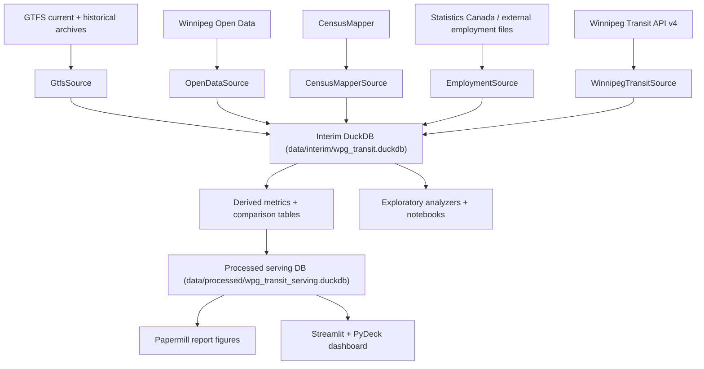
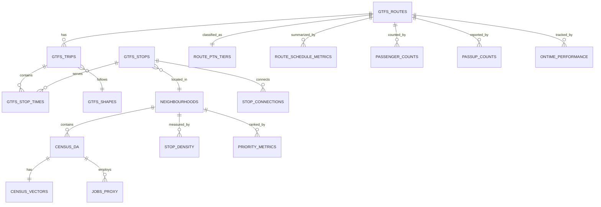

# Winnipeg 2025 Primary Transit Network Analysis

<a target="_blank" href="https://cookiecutter-data-science.drivendata.org/">
    
</a>

**COMP 4710 - Introduction to Data Mining**  
**University of Manitoba - Winter 2026**  
**Group 11**

This repository structure is adapted from **Cookiecutter Data Science — Project template by DrivenData**.

## Project Overview

This project analyzes Winnipeg's redesigned Primary Transit Network, launched on **June 29, 2025**.

PR2 focuses on four linked questions:
- How did scheduled service change across major feed regimes?
- Which stops and corridors are structurally important in the network?
- Which neighbourhoods remain underserved after the PTN launch?
- Which routes and corridors should be prioritized for intervention?

The analysis is framed by three complementary strands of literature:
- **operational GTFS visualization**: Bao et al., *PubtraVis* (2020)
- **spatiotemporal GTFS network analysis**: Farber et al., *GTFS2STN* (2024)
- **Winnipeg-specific equity and reliability context**: Steve Chicken (2024) and Stanley Ho (2024)

## Team Ownership

| Member | Responsibility | Main code surface |
|---|---|---|
| Ahmed | Data pipeline, comparison, capacity, synthesis | `ptn_analysis/data/`, `frequency.py`, notebooks `0.x` |
| Cathy | Network analysis | `network.py`, notebook `1.2` |
| Sudipta | Coverage and accessibility | `coverage.py`, notebook `1.3` |
| Stephenie | Visualization, dashboard, QA | `maps.py`, `visualization.py`, `reporting.py`, notebook `2.1` |

## Quick Start

```bash
git clone https://github.com/ahmedas22/ywg-ptn-analysis-4710-g11.git
cd ywg-ptn-analysis-4710-g11
make setup
source .venv/bin/activate
make data
make dashboard
```

Useful commands:

```bash
make data
make status
make employment
make live-bootstrap
make live-snapshots
make exports
python -m ptn_analysis.data.make_dataset live-transit
make dashboard
make figures REPORT=pr2
```

## Architecture

The project is now organized around a thin service-style data layer and class-based analysis modules.

### Data package

- `ptn_analysis/data/db.py`
  - DuckDB access, prefixed table-name helpers, DataFrame loading
- `ptn_analysis/data/download.py`
  - shared HTTP downloader with cache and retry support
- `ptn_analysis/data/sources/gtfs.py`
  - current and historical GTFS loading
- `ptn_analysis/data/sources/open_data.py`
  - Socrata/open-data ingestion
- `ptn_analysis/data/sources/census_mapper.py`
  - census and dissemination-area ingestion
- `ptn_analysis/data/sources/employment.py`
  - jobs-proxy and place-of-work ingestion from raw downloads and `data/external/`
- `ptn_analysis/data/sources/transit_api.py`
  - Winnipeg Transit API v4 normalization
- `ptn_analysis/data/live_transit.py`
  - live-transit bootstrap, sampling, and derived-table helpers
- `ptn_analysis/data/exports.py`
  - serving DuckDB export and flat-file export helpers
- `ptn_analysis/data/pipeline.py`
  - orchestration for refresh, ETL transforms, export, and status
- `ptn_analysis/data/make_dataset.py`
  - Typer CLI only

### Analysis package

- `ptn_analysis/analysis/frequency.py`
  - `FrequencyAnalyzer`
- `ptn_analysis/analysis/network.py`
  - `NetworkAnalyzer`
- `ptn_analysis/analysis/coverage.py`
  - `CoverageAnalyzer`
- `ptn_analysis/analysis/maps.py`
  - shared map styling, PTN tier colors, PyDeck layer builders, and export helpers
- `ptn_analysis/analysis/accessibility.py`
  - `build_transit_isochrone()` and `build_multimodal_isochrone()` via city2graph (optional)
- `ptn_analysis/analysis/visualization.py`
  - shared chart helpers
- `ptn_analysis/reporting.py`
  - notebook artifact contract, shared export helpers, and strict papermill execution
- `ptn_analysis/app.py`
  - Streamlit dashboard reading the serving DB and published report tables

## Pipeline

The pipeline is DuckDB-first and feed-aware.


```mermaid
flowchart TD
    A["GTFS current + historical archives"] --> B["GtfsSource"]
    C["Winnipeg Open Data"] --> D["OpenDataSource"]
    E["CensusMapper"] --> F["CensusMapperSource"]
    G["Statistics Canada / external employment files"] --> H["EmploymentSource"]
    I["Winnipeg Transit API v4"] --> J["WinnipegTransitSource"]
    B --> K["Interim DuckDB (data/interim/wpg_transit.duckdb)"]
    D --> K
    F --> K
    H --> K
    J --> K
    K --> N["Derived metrics + comparison tables"]
    N --> O["Processed serving DB (data/processed/wpg_transit_serving.duckdb)"]
    K --> P["Exploratory analyzers + notebooks"]
    O --> Q["Papermill report figures"]
    O --> R["Streamlit + PyDeck dashboard"]
```

## Storage model

- `data/raw/` holds stable rebuild inputs such as GTFS archives, merged open-data pulls, staged external files, and reference CSVs.
- `data/cache/` holds volatile request-response caches for live transit and paged open-data fetches.
- `data/interim/wpg_transit.duckdb` is the rebuildable working warehouse used by the ETL pipeline.
- `data/interim/employment/ywg/` holds reduced Parquet employment caches used for normal runs.
- `data/processed/wpg_transit_serving.duckdb` is the curated serving database used by the dashboard and polished report outputs.
- `reports/pr2/figures/` and `reports/pr2/tables/` are the PR2 paper artifact outputs generated by papermill.

## Data sources

| Source | Dataset | Description |
|---|---|---|
| Winnipeg Transit | GTFS | Scheduled routes, trips, stops, stop times, shapes |
| Historical GTFS archive | Feed snapshots | Pre/post PTN comparison regimes |
| Winnipeg Transit API v4 | Live service data | Service status, stop schedules, trip planner, advisories |
| Winnipeg Open Data | Neighbourhoods, community areas | Boundary layers |
| Winnipeg Open Data | Pass-ups | Service-quality events |
| Winnipeg Open Data | On-time performance | Schedule deviation data |
| Winnipeg Open Data | Passenger counts | Ridership context |
| Winnipeg Open Data | Cycling paths and walkways | Active-transportation context |
| CensusMapper | Dissemination areas | Demographic and commuting context |
| Statistics Canada / CBP / repo external files | Jobs proxy and workplace context | Employment destination proxy for access metrics |

## Feed regimes

PR2 standardizes on these schedule regimes:
- `2025-04-13`
- `2025-06-29`
- `2025-08-31`
- `current`

Historical comparison uses Jaccard similarity on shared stop sets to match pre-PTN routes to their post-PTN equivalents. Routes sharing more than 30% of stops are considered matches; the rest are classified as discontinued or new.

## Entity-Relationship Diagram


```mermaid
erDiagram
    GTFS_ROUTES ||--o{ GTFS_TRIPS : has
    GTFS_TRIPS ||--o{ GTFS_STOP_TIMES : contains
    GTFS_TRIPS }o--|| GTFS_SHAPES : follows
    GTFS_STOPS ||--o{ GTFS_STOP_TIMES : serves
    GTFS_STOPS }o--|| NEIGHBOURHOODS : located_in
    NEIGHBOURHOODS ||--o{ CENSUS_DA : contains
    CENSUS_DA ||--|| CENSUS_VECTORS : has
    CENSUS_DA ||--o{ JOBS_PROXY : employs
    NEIGHBOURHOODS ||--o{ STOP_DENSITY : measured_by
    NEIGHBOURHOODS ||--o{ PRIORITY_METRICS : ranked_by
    GTFS_ROUTES ||--|| ROUTE_PTN_TIERS : classified_as
    GTFS_ROUTES ||--o{ ROUTE_SCHEDULE_METRICS : summarized_by
    GTFS_ROUTES ||--o{ PASSENGER_COUNTS : counted_by
    GTFS_ROUTES ||--o{ PASSUP_COUNTS : reported_by
    GTFS_ROUTES ||--o{ ONTIME_PERFORMANCE : tracked_by
    GTFS_STOPS ||--o{ STOP_CONNECTIONS : connects
```

## Canonical derived relations

Physical relations are city-prefixed. Winnipeg uses the `ywg_` prefix.

Key derived relations:
- `ywg_stop_connections`
- `ywg_stop_connection_counts`
- `ywg_neighbourhood_stop_count_density`
- `ywg_community_area_stop_count_density`
- `ywg_route_ptn_tiers`
- `ywg_route_schedule_metrics`
- `ywg_stop_schedule_metrics`
- `ywg_route_hourly_departures`
- `ywg_route_schedule_comparison_metrics`
- `ywg_neighbourhood_transit_access_metrics`
- `ywg_neighbourhood_priority_metrics`
- `ywg_da_jobs_proxy`
- `ywg_neighbourhood_jobs_access_metrics`
- `ywg_community_area_jobs_access_metrics`
- `ywg_route_change_crosswalk_candidates`
- `ywg_h3_stop_service_metrics`
- `ywg_h3_live_delay_metrics`

Live Winnipeg Transit relations:
- `ywg_transit_service_status`
- `ywg_transit_stop_schedules`
- `ywg_transit_trip_plans`
- `ywg_transit_effective_routes`
- `ywg_transit_effective_stops`
- `ywg_transit_effective_variants`
- `ywg_transit_service_advisories`

## Public Python API

```python
from ptn_analysis import CoverageAnalyzer, FrequencyAnalyzer, NetworkAnalyzer

frequency = FrequencyAnalyzer(city_key="ywg", feed_id="current")
comparison = frequency.build_route_schedule_comparison_metrics(
    baseline_feed_id="pre_ptn",
    comparison_feed_id="current",
)

network = NetworkAnalyzer(city_key="ywg", feed_id="current")
network_metrics = network.build_network_metrics_table()
transfer_burden = network.build_transfer_burden_matrix(top_n=15)

coverage = CoverageAnalyzer(city_key="ywg", feed_id="current")
summary = coverage.summary()
underserved = coverage.underserved_neighbourhoods()
jobs_access = coverage.jobs_access()
priority_matrix = coverage.priority_matrix()
```

## External employment files

- Repo-local external employment inputs live under `data/external/`.
- The employment source tries official Statistics Canada raw downloads first for place-of-work tables.
- When a stable public raw URL is not configured for a source such as the CBP extraction, the pipeline reads the repo-local `data/external/` copy instead of referencing ad hoc paths outside the project.

## Methodology and context

The project uses a mixed methodological frame:
- GTFS and live API data describe scheduled and current transit supply.
- open-data pass-ups and on-time performance describe operational reliability.
- CensusMapper and Statistics Canada products describe demographic and workplace context.
- CBP/Borealis files provide a jobs-proxy layer for destination-side access analysis.

The most detailed methodological discussion lives in [`notebooks/0.0-ahmed-methodology.ipynb`](/Users/ahmedas/Desktop/Classes/COMP-4710-DataMining/ywg-ptn-analysis-4710-g11/notebooks/0.0-ahmed-methodology.ipynb), including the transport disadvantage framing and restored PR1-style source tables.

Key references used in the project framing:
- T. Bao et al. “PubtraVis: Public transit visualization.” *ISPRS Int. J. Geo-Inf.*, 2020.
- E. Farber et al. “GTFS2STN: Spatiotemporal transit network analysis.” *arXiv:2405.02760*, 2024.
- S. Chicken. “Why Winnipeg doesn’t know who’s riding the bus.” *The Narwhal*, 2024.
- S. Ho. *Identifying clusters of public transit unreliability through an equity lens using GIS: A study of Winnipeg, Manitoba, Canada*, 2024.

## Network still evolving

The final paper should treat PTN evaluation as a feed-regime analysis within an evolving policy environment, not as a claim that the network froze after June 29, 2025. The City of Winnipeg's February 25, 2026 service update announced:
- spring schedule improvements effective April 12, 2026
- more trips on F5, F8, 74, 557, and 676
- after-midnight service extensions on D10, D14, D16, D17, 28, 38, 43, 70, 74, and 680
- downtown route refinements under consideration for summer 2026
- D19 access changes and a D16 reliability-motivated split with a proposed new Route 18

Those post-launch adjustments should appear in the final paper as context and future-work framing, not inside the methods section.

The broader WTMP roadmap should also be treated as policy context rather than methods. Short-term PTN launch work is already in service, while PTN infrastructure, downtown rapid transit corridor design, Transit Plus family-of-services transition work, and longer-term rapid transit expansion remain in future phases tied to funding and design timelines.

## Visual system

- `maps.py` owns map styling, PTN colors, headway colors, basemap defaults, and export helpers.
- `visualization.py` owns chart styling and PR2 summary figures.
- `reporting.py` owns the report artifact contract and notebook execution.
- The dashboard uses **PyDeck** (ScatterplotLayer + ArcLayer, CARTO Positron basemap — no Mapbox token required).

## Development

```bash
make lint
make format
make test  # compile + import smoke checks
python -m ptn_analysis.data.make_dataset --help
python -m compileall ptn_analysis
```

## Acknowledgments

- **Winnipeg Transit** for GTFS and Open Data API access
- **City of Winnipeg** for the Open Data portal
- **Transitland** for historical GTFS archiving
- **CensusMapper** for dissemination-area and demographic context
